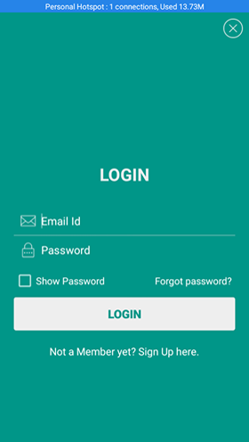
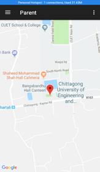
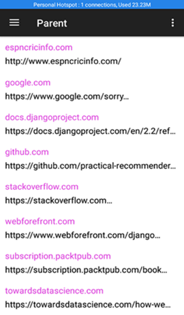

# Children-monitoring-System in Android

### login Interface

### parent main page Interface

### location tracking Interface

### Browsing History Interface

### running app Interface

I also implement conatact list fetching from children mobile.
